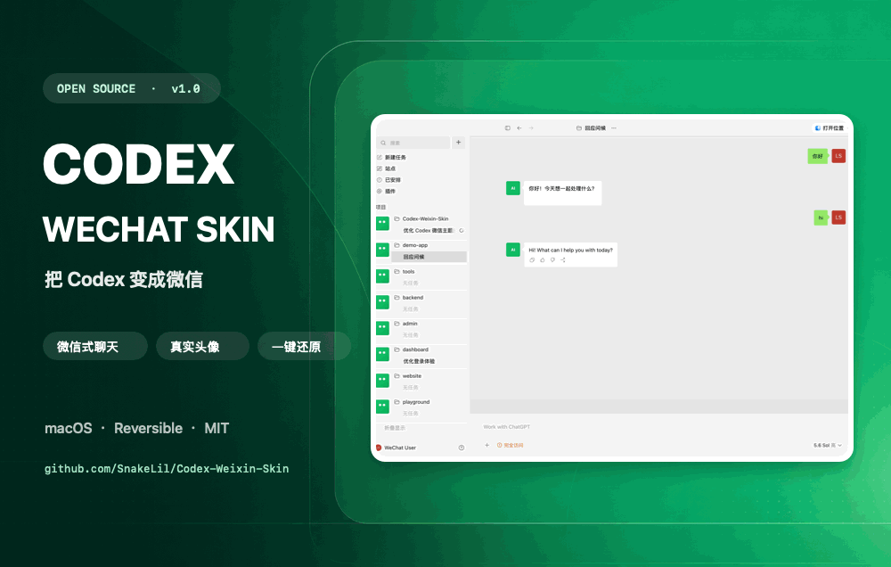
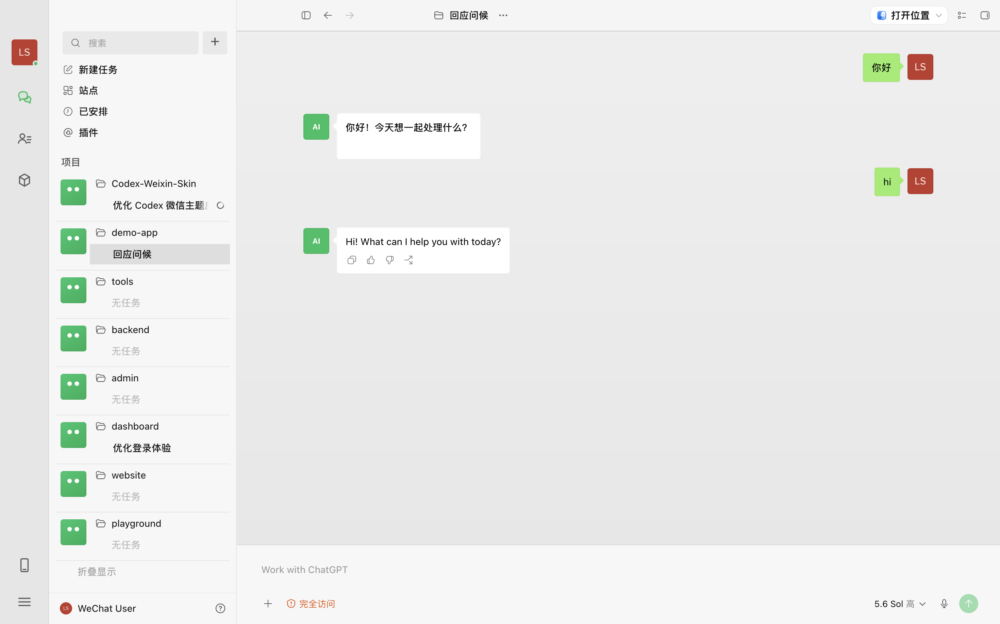
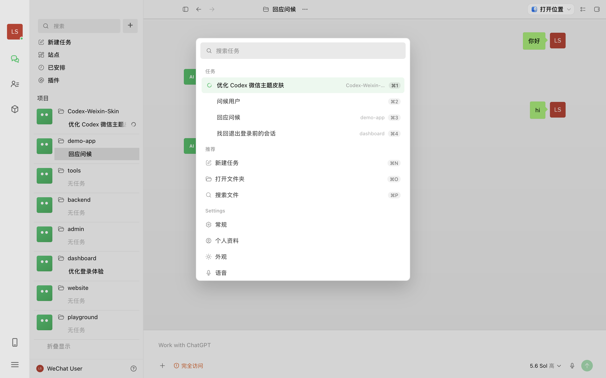
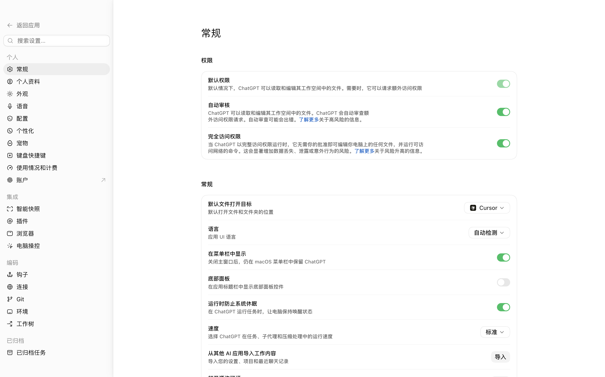
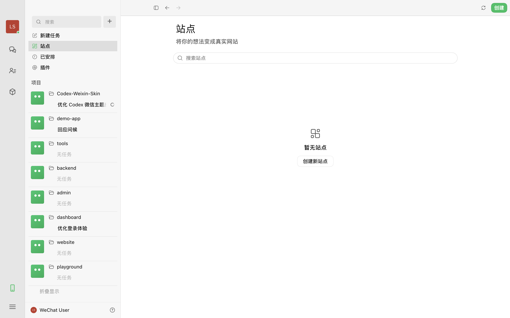
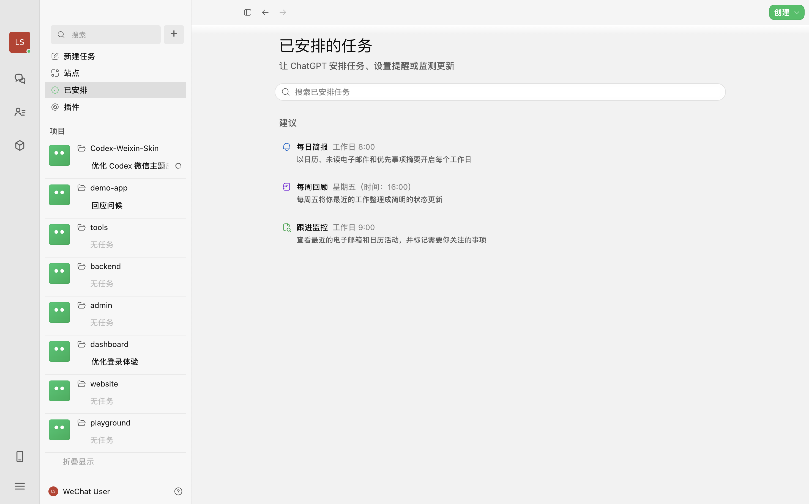
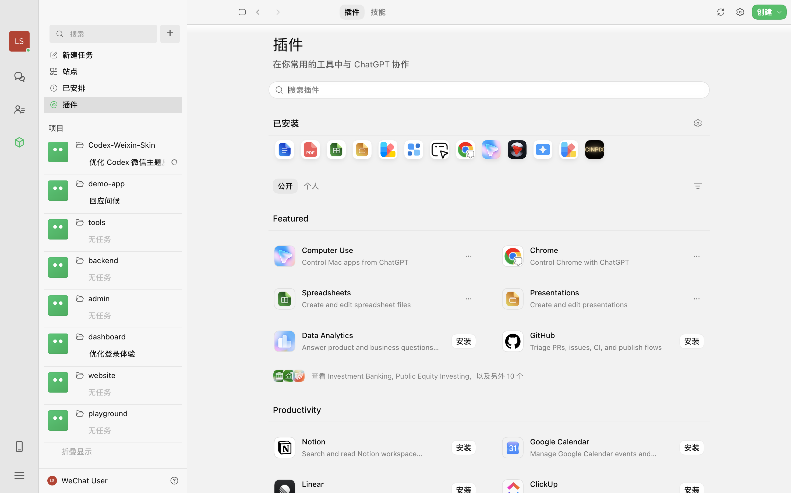

# Codex 微信主题 · Codex WeChat Skin

让官方 Codex macOS 桌面应用拥有接近桌面微信的使用体验：微信绿、三栏布局、聊天气泡、会话列表、真实用户头像，以及统一适配的搜索、设置和功能页面。

[](https://github.com/SnakeLil/Codex-Weixin-Skin/releases/latest)
[](#兼容性)
[](./LICENSE)

[English](./README.en.md) · 简体中文

[**下载最新版本**](https://github.com/SnakeLil/Codex-Weixin-Skin/releases/latest) · [CodeDrobe Lite 商店版](https://codedrobe.app/zh/themes/codex-wechat-skin-lite) · [安装教程](#图形化安装推荐) · [反馈问题](https://github.com/SnakeLil/Codex-Weixin-Skin/issues/new/choose)



> [!IMPORTANT]
> 本项目是非官方主题，与 OpenAI、腾讯或微信无关联。Codex 与微信均为各自权利人的商标。

## 主题特色

- **微信式三栏布局**：60px 功能导航栏、项目/会话列表和主内容区。
- **聊天气泡**：用户消息使用微信绿色气泡，助手消息使用白色气泡，并带有气泡尖角。
- **真实头像**：侧边栏头像和聊天中的“我”使用当前 Codex 用户头像。
- **完整页面适配**：聊天、全局搜索、设置、站点、已安排任务和插件页面使用统一视觉语言。
- **微信交互细节**：选中态、未读红点、搜索框、按钮、开关和细分割线均经过主题化。
- **浅色 / 深色预设**：内置 `微信 · 浅色` 与 `微信 · 深色` 两套主题。
- **自定义背景**：可以载入自己的聊天背景图并调整配色。
- **随时还原**：不修改 Codex 应用文件和签名，一键恢复官方外观。

## 界面预览



| 搜索 | 设置 |
| --- | --- |
|  |  |

| 站点 | 已安排任务 |
| --- | --- |
|  |  |

| 插件 |
| --- |
|  |

## CodeDrobe Lite 商店版

[Codex WeChat Skin Lite](https://codedrobe.app/zh/themes/codex-wechat-skin-lite) 是面向 CodeDrobe Desktop 的纯 CSS 轻量版本，可以从商店一键应用和恢复。它保留微信绿、聊天气泡、搜索、设置和功能页配色，且不包含可执行脚本。

Lite 版适合快速体验；本仓库的完整版继续提供微信式三栏布局、真实用户头像、未读红点、深浅色预设和自定义背景等增强能力。商店版源码位于 [`integrations/codedrobe/codex-wechat-skin-lite`](./integrations/codedrobe/codex-wechat-skin-lite)。

完整版与 Lite 版的微信颜色、气泡、圆角和基础间距来自同一份 [`macos/design/wechat-tokens.json`](./macos/design/wechat-tokens.json)，并由自动测试阻止两版设计变量意外漂移。

## 环境要求

- macOS
- 已安装官方 Codex 桌面应用（当前应用名称可能显示为 ChatGPT）
- Codex 至少正常启动过一次
- 无需另外安装 Node.js

目前仅支持 macOS。Codex 更新界面结构后，主题选择器可能需要同步更新。

## 兼容性

| 项目 | 状态 |
| --- | --- |
| macOS | 12.0 或更高版本（跟随当前官方 Codex 应用要求） |
| Apple Silicon | 已支持；v1.0.0 在 Apple Silicon + macOS 15.5 上验证 |
| Intel Mac | 安装器包含架构自检，欢迎反馈实机结果 |
| Codex Desktop | v1.0.0 已在 `26.715.31925` 上验证；应用更新后若出现异常请提交 Issue |
| Windows / Linux | 暂不支持 |

“已验证”表示完成了真实界面测试，不代表主题仅能用于该版本。

## 安装与使用

### 图形化安装（推荐）

新版本优先提供 `Codex-Weixin-Skin-vX.Y.Z.dmg`：打开 DMG，双击 **Install Codex WeChat Skin.app**，按界面提示即可完成安装并启动主题。安装器不会强制退出 Codex；请先保存工作并自行退出 Codex。

> GitHub Release 的社区 DMG 采用 ad-hoc 签名，尚未经过 Apple 公证。首次打开可能被 Gatekeeper 拦截；请右键安装器选择“打开”，或前往“系统设置 → 隐私与安全性 → 仍要打开”。这不是主题安装失败。

如果当前 Release 只提供 ZIP，也可以下载 `Codex-Weixin-Skin-v1.0.0.zip` 并解压。开发者还可以使用 Git 克隆：

```bash
git clone https://github.com/SnakeLil/Codex-Weixin-Skin.git
```

1. 先正常启动一次 Codex，然后保存工作并**完全退出 Codex**。
2. 使用 DMG 中的安装器 App；ZIP / Git 用户则打开项目的 `macos` 文件夹。
3. ZIP / Git 用户右键点击 **Install Codex Weixin Skin.command**，选择“打开”。
4. 安装程序会把主题复制到稳定目录，创建桌面快捷启动器，并启动带微信主题的 Codex。

首次打开若被 macOS 拦截，请在“系统设置 → 隐私与安全性”中选择“仍要打开”，或再次右键选择“打开”。

### 以后如何启动

安装完成后，桌面会出现以下快捷入口：

| 快捷入口 | 作用 |
| --- | --- |
| **Codex WeChat Skin.command** | 启动或重新应用微信主题 |
| **Codex WeChat Skin - Customize.command** | 切换预设、修改颜色或载入聊天背景 |
| **Codex WeChat Skin - Diagnostics.command** | 导出不含聊天内容和账号信息的匿名诊断包 |
| **Codex WeChat Skin - Verify.command** | 验证主题并生成当前界面截图 |
| **Codex WeChat Skin - Restore.command** | 移除主题并恢复官方外观 |

> [!TIP]
> 如果重启 Codex 后恢复了默认外观，请退出 Codex，再双击桌面的 **Codex WeChat Skin.command**。主题依赖仅监听本机回环地址的调试连接，普通方式启动 Codex 时不会自动开放该连接。

### 命令行安装

```bash
cd Codex-Weixin-Skin/macos

# 安装到 ~/.codex/codex-weixin-skin-studio，但暂不启动
./scripts/install-weixin-skin-macos.sh --no-launch

# 启动 / 重新应用主题
~/.codex/codex-weixin-skin-studio/scripts/start-weixin-skin-macos.sh --prompt-restart
```

## 切换主题和自定义

```bash
# 微信浅色（默认）
~/.codex/codex-weixin-skin-studio/scripts/switch-theme-macos.sh \
  --id preset-wechat-light

# 微信深色
~/.codex/codex-weixin-skin-studio/scripts/switch-theme-macos.sh \
  --id preset-wechat-dark
```

也可以双击 **Customize Codex Weixin Skin.command**，通过可视化窗口选择预设、调整主题色或载入自己的背景图。

可选安装 [SwiftBar](https://swiftbar.app/) 后，再双击 **Install Menu Bar.command**，即可从菜单栏快速应用、暂停、验证或还原主题。

## 工作原理与安全边界

- 不修改官方 `.app`、`app.asar` 或代码签名。
- 在启动时仅向 `127.0.0.1` 开放本地 CDP（Chrome DevTools Protocol）端口。
- 使用 Codex 自带且经过签名校验的 Node.js 运行时，不要求全局 Node 环境。
- 通过本地 CDP 将自包含的 CSS 和渲染脚本注入 Codex 页面，并监听页面变化持续适配。
- 安装前会备份 `~/.codex/config.toml`，仅管理外观相关配置。
- 主题运行状态保存在 `~/Library/Application Support/CodexWeixinSkinStudio/`。
- 调试端口只绑定本机回环地址，不监听局域网或公网地址。

## 验证主题

```bash
~/.codex/codex-weixin-skin-studio/scripts/verify-weixin-skin-macos.sh \
  --screenshot "$HOME/Desktop/Codex-WeChat-Skin.png"
```

验证会检查当前主题 ID、注入版本、页面布局和横向溢出，并生成截图。

项目还维护聊天、搜索、设置、站点、已安排任务、插件和置顶摘要七个脱敏 DOM 页面快照。每个 main 提交和 Pull Request 都会在独立 Chromium 中加载真实主题 CSS，检查关键节点、计算样式、横向溢出和摘要布局，并重新打包检查 CodeDrobe Lite 版本。测试不会启动、退出或修改正在使用的 Codex。开发者可以在本地运行：

```bash
cd macos
npm install
npx playwright install chromium
npm test
```

### 导出匿名诊断包

遇到安装、启动或兼容性问题时，双击桌面的 **Codex WeChat Skin - Diagnostics.command**，即可在桌面生成一个 ZIP 并自动在 Finder 中定位。诊断包只包含系统/Codex/主题版本、主题运行状态、载荷完整性和兼容性覆盖信息；不会收集聊天内容、截图、原始日志、账号数据、自定义主题名称或本地路径，也不会连接正在使用的 Codex 调试端口。可以将该 ZIP 直接附到 [Bug Issue](https://github.com/SnakeLil/Codex-Weixin-Skin/issues/new/choose)。

命令行也可以安全导出：

```bash
~/.codex/codex-weixin-skin-studio/scripts/export-diagnostics-macos.sh
```

## 还原与卸载

双击桌面的 **Codex WeChat Skin - Restore.command**，或运行：

```bash
~/.codex/codex-weixin-skin-studio/scripts/restore-weixin-skin-macos.sh \
  --restore-base-theme --restart-codex
```

这会移除运行时主题、恢复备份的外观配置，并清理主题创建的桌面快捷入口。

## 常见问题

### 重启后主题消失

这是因为 Codex 被普通方式启动，未开放本地主题调试连接。退出 Codex，然后使用桌面的 **Codex WeChat Skin.command** 重新启动即可。

### 双击安装器没有运行

右键 `.command` 文件选择“打开”；若仍被阻止，请前往“系统设置 → 隐私与安全性”允许打开。

### 提示 Codex 正在运行

首次安装时必须先完全退出 Codex，避免应用退出过程中覆盖配置文件。退出后重新执行安装器。

### Codex 更新后布局异常

先重新运行安装器以更新已安装的主题文件。如果问题仍存在，请附上 Codex 版本和截图提交 Issue。

## 项目结构

```text
Codex-Weixin-Skin/
├── README.md / README.en.md
├── LICENSE
├── docs/screenshots/              # 主题实拍截图
└── macos/
    ├── assets/                    # CSS、渲染脚本和默认主题资源
    ├── presets/                   # 微信浅色 / 深色预设
    ├── scripts/                   # 安装、启动、注入、验证和还原工具
    ├── menubar/                   # SwiftBar 菜单栏插件
    └── *.command                  # 可双击启动器
```

## 参与贡献

欢迎提交 Issue 和 Pull Request。若反馈界面问题，请尽量提供：

- Codex 版本与 macOS 版本
- 出现问题的页面与复现步骤
- 隐去敏感内容后的截图
- `Verify Codex Weixin Skin.command` 的验证结果

## 致谢

安装与本地 CDP 注入思路参考了 [Codex-Dream-Skin](https://github.com/Fei-Away/Codex-Dream-Skin)。本项目重新设计并实现了微信主题的布局、样式与交互适配。

## 许可证与免责声明

本项目采用 [MIT License](./LICENSE)。

本项目仅用于个性化本地应用界面。使用者需自行承担 Codex 版本变化、第三方应用条款及运行时调试接口带来的风险。
